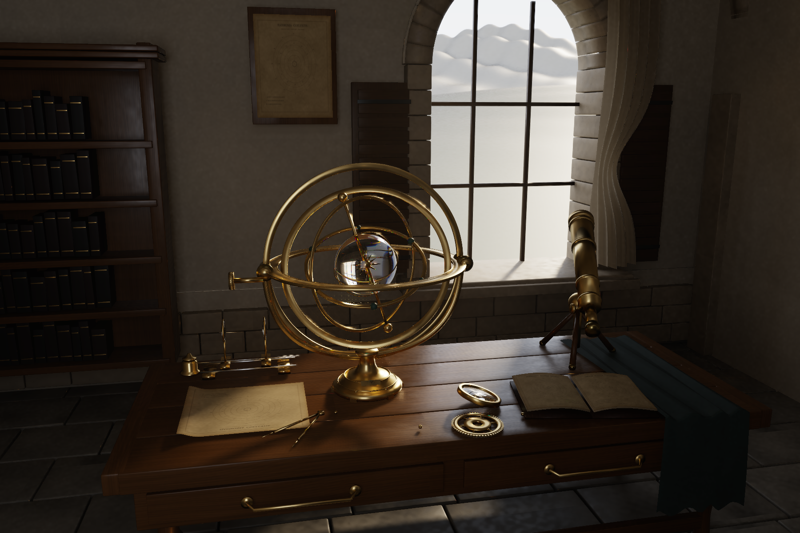

# CYBR Scenes

Native-rendered 3D scenes with the code, input geometry, material recipes, images, and evidence needed to inspect and reproduce them.

## Quiet Observatory IV

[](scenes/observatory-iv/renders/Observatory_IV.png)

A vaulted observatory with a brass armillary, a dispersive quartz globe, a two-lens optical bench, a telescope, books, and authored cloth. It is rendered offline by a native C++ CPU spectral path tracer using the retained CYBR GEO triangle-intersection and BVH kernel.

**[Download the complete source package](downloads/CYBR_Observatory_IV_Source.zip?raw=true)** · [Full-resolution render](scenes/observatory-iv/renders/Observatory_IV.png?raw=true) · [Unfiltered image](scenes/observatory-iv/renders/Observatory_IV_unfiltered.png?raw=true) · [Scene documentation](scenes/observatory-iv/README.md)

The two images are the original delivered renders, not new renders made during repository publication. They are native 1800 × 1200 outputs. The finished image uses non-neural reconstruction; the unfiltered image retains sampling noise. Neither is upscaled or generated by an image model.

## Build from a fresh checkout

The tested platform is Linux on an AVX2/FMA-capable x86-64 CPU, with a C++17 compiler, OpenMP, CMake 3.16+, and Python 3. Rendering is CPU-only. The scene documentation discusses memory requirements and untested platforms.

```bash
git clone --branch add-observatory-iv https://github.com/cybrdelic/cybr-scenes.git
cd cybr-scenes/scenes/observatory-iv

python3 -m venv .venv
source .venv/bin/activate
python -m pip install -r requirements.txt

# Required: build the transport mesh and material binaries from included assets.
python build_scene.py

# Compile, run native tests, render the delivered camera, and reconstruct.
bash render.sh
```

The finished reproduction is written to `scenes/observatory-iv/renders/reproduction.png`. Native radiance, component outputs, refraction-aware geometry guides, and metadata are retained alongside it. Set `THREADS=8 bash render.sh` to change concurrency. The scene README documents alternative cameras and the native CLI.

**No original ChatGPT attachment is needed after cloning.** The source checkout includes the retained input GLB and all geometry/material authoring code. The large prepared transport mesh, inspection GLB, and mipmapped texture binaries are generated by `build_scene.py`, rather than stored in Git.

The import branch is named explicitly above until this addition is merged. After merging, a normal clone of the default branch is sufficient.

## Test without a production render

```bash
# From scenes/observatory-iv, after installing dependencies and building assets:
cmake -S . -B build -DCMAKE_BUILD_TYPE=Release
cmake --build build -j2
ctest --test-dir build --output-on-failure
python verify.py --geometry-only

./build/observatory --mesh scene/observatory.cvr2 --out renders/ci_smoke \
  --width 64 --height 48 --spp 4 --depth 6 --threads 2
./build/observatory --mesh scene/observatory.cvr2 --out renders/ci_smoke \
  --width 64 --height 48 --threads 2 --guides-only
python finish.py renders/ci_smoke
python verify.py --stem renders/ci_smoke
```

Use full finishing for this validation command: `finish.py --preview` deliberately skips the raw EXR export that `verify.py` checks.

The [native-scene workflow](.github/workflows/observatory.yml) checks the imported files, rebuilds assets, compiles the renderer, runs numerical and geometry tests, and renders a 64 × 48 smoke image. Its artifact contains the new smoke output and checks. **A passing smoke test is not a new production render, a convergence test, or a photorealism score.**

The scene's `verification/` directory initially contains the historical delivery records. Running `verify.py` updates its geometry/delivery report files for the current run; keep a clean Git checkout or copy those reports before running it when preserving the historical records matters.

## What is included

| Location | Contents |
| --- | --- |
| `scenes/observatory-iv/src/` | Complete native renderer, spectral model, sampler, BVH and texture loader |
| `scenes/observatory-iv/build_scene.py` | Geometry and material authoring recipe |
| `scenes/observatory-iv/assets/` | Retained binary input geometry and eleven material preview maps |
| `scenes/observatory-iv/renders/` | Original full-resolution finished/unfiltered images and render metadata |
| `scenes/observatory-iv/verification/` | Historical build, numerical, geometry and delivery evidence |
| `downloads/CYBR_Observatory_IV_Source.zip` | The original, checksum-verified compact source archive |
| `docs/observatory-iv-import.json` | Imported file sizes and SHA-256 hashes |
| `docs/observatory-iv-gallery.html` | Local image comparison page; open it from a downloaded checkout |

The archived source is 14,922,796 bytes with SHA-256 `ebf85d46b54a510915cf48e15f14944cac33e81be3f7a9e9618f29a38f549a0a`. It preserves the original package layout; the repository places that same scene under `scenes/observatory-iv/`.

The optional original full-resolution raw EXR, sixteen-band framebuffer, and large ready-to-render archive are **not included in this compact import**. Running the supplied renderer produces new raw outputs. References in the original scene README to ready-to-render or raw-data files describe those separate delivery variants, not additional files already present in this checkout.

## Rendering scope

The renderer includes sixteen fixed spectral bins, wavelength-dependent quartz refraction, anisotropic metal shading, sampled indirect illumination, and a bounded homogeneous participating medium. Reconstruction uses separated illumination components and geometry/variance guides. The dominant transmitted guide is an approximation for mixed reflection and transmission.

This is an authored visual scene, not a physically validated historical observatory or mechanical CAD model. The cloth and landscape are modeled rather than dynamically simulated or DEM-derived. Spectra are mostly authored rather than measured; the directional emitter is not calibrated to the actual Sun. Quartz birefringence, polarization, diffraction, and fluorescence are not modeled. Raw images contain Monte Carlo error, and reconstruction changes some fine illumination detail. See the [full limitations](scenes/observatory-iv/README.md#important-boundaries).

## License and provenance

GPL-2.0-only. Original source notices are retained. See [LICENSE](LICENSE) and the scene's [provenance and dependency notices](scenes/observatory-iv/THIRD_PARTY_NOTICES.md). No font binaries or third-party renderer binaries are bundled.
