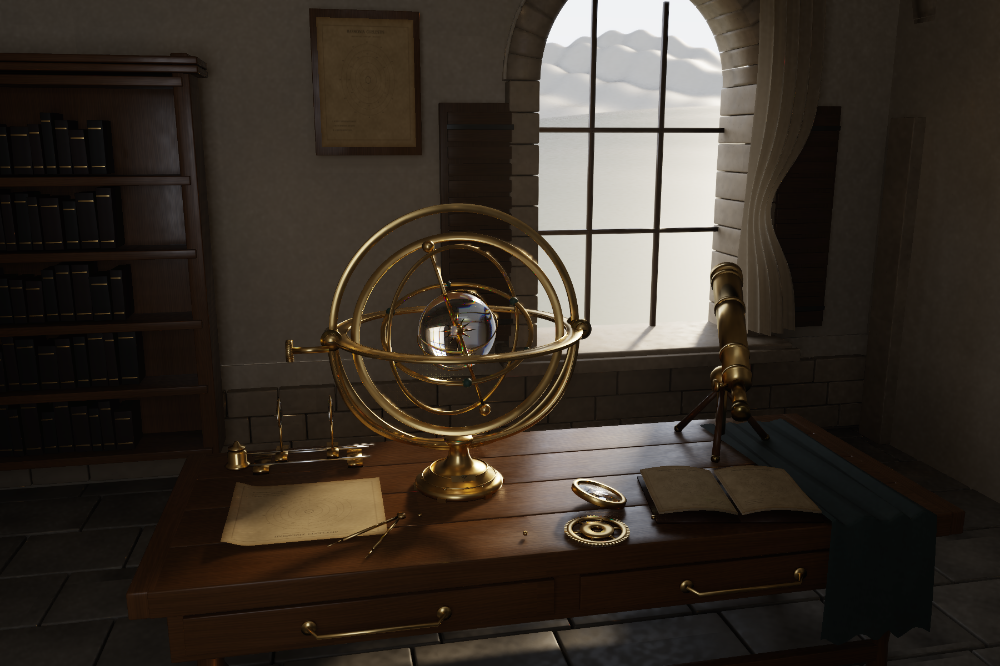

# CYBR Scenes

**Procedural environments and native spectral rendering.**

Seven authored 3D scenes: vaulted architecture, woodland, sandstone, basalt coast, mineral pools, volcanic rock and a flooded quartz cavern. The repository includes the geometry builders, material recipes, native C++ renderers and finished images.

[](scenes/observatory-iv/renders/Observatory_IV.png)

*Quiet Observatory IV — 1800 × 1200 native render. Vaulted room, brass armillary, quartz optics, authored cloth and a two-lens optical bench.* [Scene source](scenes/observatory-iv) · [Unfiltered render](scenes/observatory-iv/renders/Observatory_IV_unfiltered.png)

## Selected environments

| Drowned Geode | Fernwater |
| --- | --- |
|  |  |
| Fracture-cell rock, quartz, skylight and water transport | Procedural trees, ferns, curled litter and a winding stream |

[All six environment images](environments/gallery.html) · [Scene registry](environments/scenes.json) · [Environment source guide](environments/README.md)

The displayed images are retained renders. New runs produce separate images and their own metadata; they do not replace these examples.

## Run it

Linux or WSL2, Python **3.11–3.13**, g++/OpenMP and CMake. Observatory requires an x86-64 CPU with AVX2/FMA; Drowned Geode requires AVX2. Rendering runs on the CPU.

```bash
sudo apt-get update
sudo apt-get install -y g++ cmake
git clone https://github.com/cybrdelic/cybr-scenes.git
cd cybr-scenes
python3 -m venv .venv
source .venv/bin/activate
python -m pip install -r requirements.txt
python cybr_scenes.py render observatory-iv --quality preview
```

**One command prepares the scene, compiles the native renderer, renders, finishes and checks the result.** Open **`outputs/observatory-iv/hero/hero.png`**. The success receipt is written after the output checks pass. Input assets are included; no previous attachment or prepared mesh archive is needed.

```bash
python cybr_scenes.py list
python cybr_scenes.py doctor observatory-iv
python cybr_scenes.py render observatory-iv --quality smoke
python cybr_scenes.py render sandstone-passage --quality preview
python cybr_scenes.py render drowned-geode --quality production --threads 4
```

`smoke` renders a small frame for installation checks. `preview` is the default iteration budget. `production` uses each scene's authored sample budget and larger resolution. All three use the actual scene geometry. Full environment geometry can require several GB of RAM and minutes to prepare, especially the woodland. [Settings, platforms and troubleshooting](docs/RUNNING.md).

Matching output can be reused after checking the settings and input/output hashes. Changed resolution, sampling, camera, source or geometry triggers the relevant rebuild. Logs, prepared meshes and fresh reports live in ignored build/output directories. Historical delivery evidence stays separate.

## Engineering inside

| Area | Source to inspect |
| --- | --- |
| Spectral transport | [Observatory integrator](scenes/observatory-iv/src/observatory.cpp), [spectral model](scenes/observatory-iv/src/spectrum.h) |
| Acceleration and sampling | [Wide BVH](scenes/observatory-iv/src/wide_bvh.h), [geometry kernel](scenes/observatory-iv/src/spectral_geometry.h), [Sobol directions](scenes/observatory-iv/src/sobol_directions.h) |
| Geometry authoring | [Observatory builder](scenes/observatory-iv/build_scene.py), [environment engines](environments/engines) |
| Surface detail | [Footprint-filtered material atlas](environments/shared/surface_detail.hpp), [continuous vertex/normal deformation](environments/tools/enhance_geometry.py) |
| Optical reconstruction | [Separated illumination and transmitted guides](scenes/observatory-iv/finish.py), [environment reconstruction](environments/tools/finish_r2.py) |
| Repeatable execution | [Root workflow](cybr_scenes.py), [backend adapters](environments/cybr_scenes.py), [durable process supervision](environments/execution_runtime.py) |

The environments retain four distinct native backends. The common workflow coordinates them; their transport models remain scene-specific. Observatory uses sixteen spectral bins with wavelength-dependent quartz refraction, anisotropic metal shading and a bounded participating medium. Reconstruction uses geometry and variance guides.

## Development

```bash
python -m unittest discover -s tests -v
python -m unittest discover -s environments/tests -v
python cybr_scenes.py render observatory-iv --quality smoke
```

[Quickstart CI](.github/workflows/quickstart.yml) exercises the root workflow and tests on Python 3.11–3.13. [Environment CI](.github/workflows/recovered-environments.yml) tests all four native backends; its manual render matrix covers all six environments. [Retained verification gallery](docs/recovery-proof/README.md).

## Scope and license

Geometry-driven native renders, with no image-generation step. Some materials use retained CC0 surface photographs; Observatory's maps are mathematically authored. These scenes are rendering studies: authored spectra, finite sampling and guided reconstruction have limits. [Scene limitations](scenes/observatory-iv/README.md#important-boundaries) · [Asset/dependency notices](scenes/observatory-iv/THIRD_PARTY_NOTICES.md) · [Original import record](docs/observatory-iv-import.json).

GPL-2.0-only. Third-party assets retain their own rights. Created by [Alejandro Figueroa / cybrdelic](https://github.com/cybrdelic).
