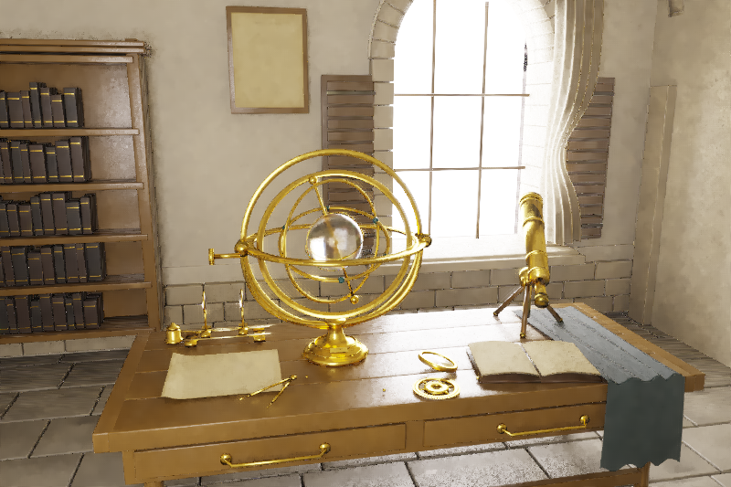
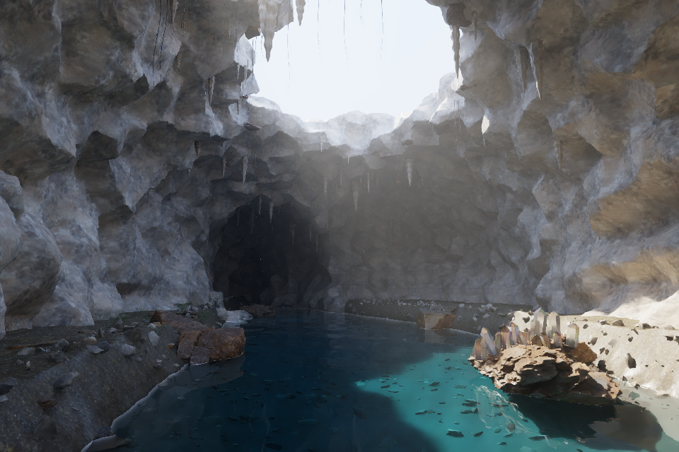
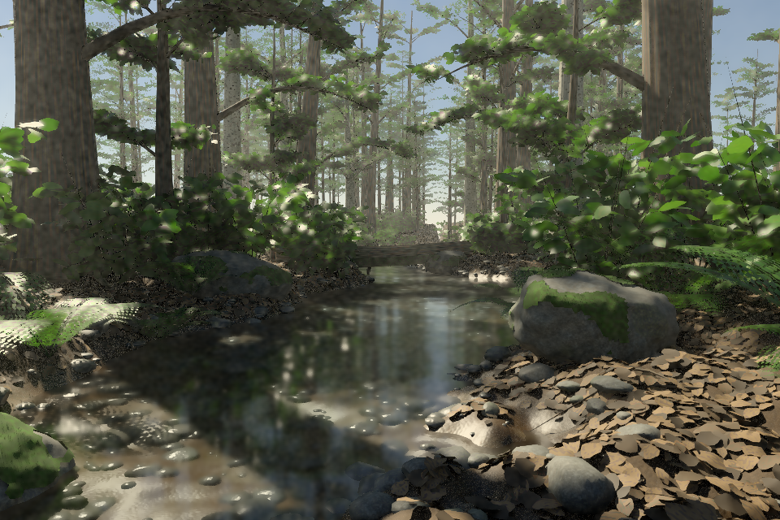

# CYBR Scenes

**Procedural environments and native spectral rendering.**

Seven authored 3D scenes: vaulted architecture, woodland, sandstone, basalt coast, mineral pools, volcanic rock and a flooded quartz cavern. The repository includes the geometry builders, material recipes, a bundled CYBR LIGHT spectral renderer and finished images.

[](media/light/observatory_hero.png)

*Fresh CYBR LIGHT preview — 800 × 533, 96 spectral packets × 8 wavelengths. Actual vaulted architecture, brass armillary, quartz optics and authored cloth.* [Scene source](scenes/observatory-iv) · [Unfiltered render](media/light/observatory_hero_unfiltered.png) · [Reproduction record](media/light/README.md)

## Selected environments

| Drowned Geode | Fernwater |
| --- | --- |
|  |  |
| Fracture-cell rock, quartz, skylight and water transport | Procedural trees, ferns, curled litter and a winding stream |

[All six environment images](environments/gallery.html) · [Scene registry](environments/scenes.json) · [Environment source guide](environments/README.md)

The environment images above are retained renders. New runs produce separate images and their own metadata; they do not replace these examples.

## Run it

Linux or WSL2, Python **3.11–3.13** and g++/OpenMP. CYBR LIGHT compiles once on demand and runs on the CPU; a GPU is not required.

```bash
sudo apt-get update
sudo apt-get install -y g++ cmake
git clone https://github.com/cybrdelic/cybr-scenes.git
cd cybr-scenes
python3 -m venv .venv
source .venv/bin/activate
python -m pip install -r requirements.txt
python cybr_scenes.py render observatory-iv --quality preview
```

**One command prepares the scene, compiles the native renderer, renders, finishes and checks the result.** Open **`outputs/observatory-iv/hero/hero.png`**. The success receipt is written after the output checks pass. Input assets are included; no previous attachment or prepared mesh archive is needed.

```bash
python cybr_scenes.py list
python cybr_scenes.py doctor observatory-iv
python cybr_scenes.py render observatory-iv --quality smoke
python cybr_scenes.py render sandstone-passage --quality preview
python cybr_scenes.py render drowned-geode --quality production --threads 4
```

`smoke` renders a small frame for installation checks. `preview` is the default iteration budget. `production` increases both resolution and spectral sampling. All three use the actual scene geometry. Full environment geometry can require several GB of RAM and minutes to prepare, especially the woodland. [Settings, platforms and troubleshooting](docs/RUNNING.md).

Matching output can be reused after checking the settings and input/output hashes. Changed resolution, sampling, camera, source or geometry triggers the relevant rebuild. Logs, prepared meshes and fresh reports live in ignored build/output directories. Historical delivery evidence stays separate.

## Engineering inside

| Area | Source to inspect |
| --- | --- |
| Spectral transport | [CYBR LIGHT engine](rendering/cybr_light/native), [scene adapter](rendering/light_render.py) |
| Acceleration and sampling | [Indexed meshlets and SAH BVH](rendering/cybr_light/native/include/cybr/geometry.hpp), [packing and runtime](rendering/cybr_light/runtime.py) |
| Geometry authoring | [Observatory builder](scenes/observatory-iv/build_scene.py), [environment engines](environments/engines) |
| Surface detail | [Footprint-filtered material atlas](environments/shared/surface_detail.hpp), [continuous vertex/normal deformation](environments/tools/enhance_geometry.py) |
| Optical reconstruction | [Separated illumination and transmitted guides](scenes/observatory-iv/finish.py), [environment reconstruction](environments/tools/finish_r2.py) |
| Repeatable execution | [Root workflow](cybr_scenes.py), [backend adapters](environments/cybr_scenes.py), [durable process supervision](environments/execution_runtime.py) |

The root workflow now defaults to **CYBR LIGHT** for all seven scenes. Indexed meshlets share vertices during native BVH traversal, with at most 64 full-attribute vertices and 124 triangles per group. The adapter preserves actual geometry, normals, UVs, vertex tint and component IDs. Spectral glass, metals, normal maps and retained lava temperature fields use CYBR LIGHT transport. Linear PFM/EXR films and unfiltered images stay beside the finished PNG.

The original scene-specific transport remains available with `--renderer authored` for historical reproduction, including its specialized water estimators. CYBR LIGHT uses its general BSDF/volume models; these are different optical implementations. [Renderer source and provenance](rendering/cybr_light/UPSTREAM.json).

## Development

```bash
python -m unittest discover -s tests -v
python -m unittest discover -s environments/tests -v
python cybr_scenes.py render observatory-iv --quality smoke
```

[Quickstart CI](.github/workflows/quickstart.yml) exercises the root workflow and tests on Python 3.11–3.13. [Environment CI](.github/workflows/recovered-environments.yml) tests all four native backends; its manual render matrix covers all six environments. [Retained verification gallery](docs/recovery-proof/README.md).

## Scope and license

Geometry-driven native renders, with no image-generation step. Some materials use retained CC0 surface photographs; Observatory's maps are mathematically authored. These scenes are rendering studies: authored spectra, finite sampling and guided reconstruction have limits. [Scene limitations](scenes/observatory-iv/README.md#important-boundaries) · [Asset/dependency notices](scenes/observatory-iv/THIRD_PARTY_NOTICES.md) · [Original import record](docs/observatory-iv-import.json).

GPL-2.0-only. Third-party assets retain their own rights. Created by [Alejandro Figueroa / cybrdelic](https://github.com/cybrdelic).
