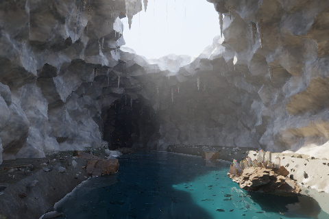
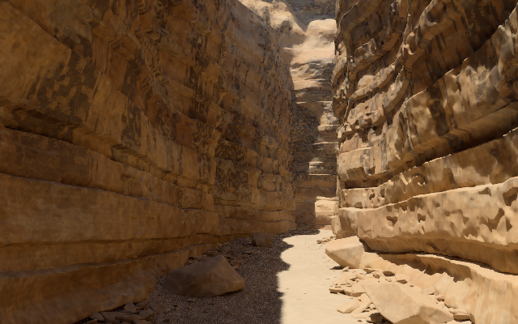

# Fresh recovery verification

Generated on 2026-09-22 UTC by [run 35670895190](https://github.com/cybrdelic/cybr-scenes/actions/runs/35670895190), not copied from historical renders. Each directory includes its output PNG, native execution receipt and verification JSON. All six passed: finite transport radiance, correct dimensions, nonblank images, positive triangle counts and zero reported nonfinite path samples. All were visually inspected.

These 480-pixel, 24-sample/48-water-sample images prove complete execution of full geometry. Sampling noise remains, especially in foliage; they do not establish production image quality or physical-reference accuracy. Raw films and geometry are rebuilt by the workflow and are not duplicated in this small proof package.

| Scene | Native triangles | Fresh image and evidence |
| --- | ---: | --- |
| Sandstone Passage | 8,108,728 | [Image](sandstone-passage/hero.png) · [Verification](sandstone-passage/verification.json) |
| Basalt Tide | 11,644,696 | [Image](basalt-tide/hero.png) · [Verification](basalt-tide/verification.json) |
| Fernwater | 20,400,077 | [Image](fernwater/hero.png) · [Verification](fernwater/verification.json) |
| Desert Hot Springs | 23,690,858 | [Image](desert-hot-springs/hero.png) · [Verification](desert-hot-springs/verification.json) |
| Obsidian Reach | 6,210,833 | [Image](obsidian-reach/hero.png) · [Verification](obsidian-reach/verification.json) |
| Drowned Geode | 3,655,632 | [Image](drowned-geode/hero.png) · [Verification](drowned-geode/verification.json) |

## New creation: Amber Passage

[Successful creation run](https://github.com/cybrdelic/cybr-scenes/actions/runs/35671674210) · [Camera changes and verification](amber-passage/creation.json) · [Native receipt](amber-passage/receipt.json)

This is a new camera/finishing composition using the recovered geometry, not a new geometry generator. Rendered at 640 × 400 and 32 samples per pixel. The default sandstone preset was not modified.

Tests: 36 Python tests passed; geo, hot, geode and obsidian C++ engines compiled; the first three also passed their implemented native self-tests. The existing Observatory IV was preserved without source changes; its separate pre-existing workflow remains available.
