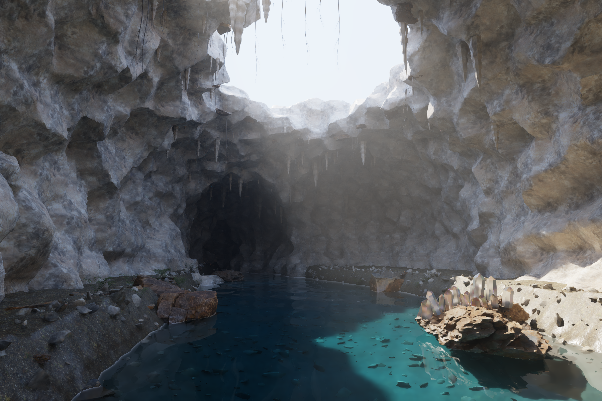

# CYBR — Drowned Geode V3

A new execution of the flooded mineral cavern through the supplied **native CYBR GEO C++ CPU renderer**. This revision rebuilds the chamber and its optical subjects; it does not modify the previous PNG. Geometry, photographed material inputs, renderer source, raw buffers, and verification are included or rebuilt by the scripts below. No image-generation model, generated background, inpainting, neural denoiser, or synthesized detail is used.



## The substantive changes

### Continuous fractured rock, not noise-displaced tubes

`build_v3.py` classifies an irregular, sheared three-dimensional lattice of cells against connected authored chamber volumes. The difference between distances to solid and empty cell sets defines the principal fracture surface. A smaller continuous-field contribution avoids purely faceted cell walls. Marching cubes reconstructs the shared boundary, with irregular bedding relief and displacement from the supplied photographed rock-height map.

The chamber, unequal side recesses, collapsed roof, and low rear tunnel are now one connected rock construction. The former round buttress and block cladding were rejected. The exterior roof is finite: the opening is a real shallow collapse rather than a tall, bright-walled shaft. Smaller scanned fragments, anchored dripstone, and branching roots interrupt its rim.

The lake bed is a new irregular basin with explicit submerged gravel and differently scaled talus. Foreground host rocks use the supplied scanned meshes, positioned and partially embedded rather than floating. This is **authored geology**, not a measured cave, erosion simulation, DEM reconstruction, or mechanical fracture simulation.

### Quartz geometry and robust optical boundaries

Larger quartz points are placed along restricted seams on scanned host surfaces, not across a regular planting grid. Each placement is ray-anchored to its host. Unequal facet distances, asymmetric inclinations, truncated terminations, bevel planes, and smaller intergrowths replace uniform points. Selected points contain modeled milky mineral cores and sparse plate-like inclusions. These are geometric inclusions, not a validated crystal-defect scattering model.

The half-space intersections are retriangulated at the **actual float32 positions** supplied to the renderer. Tiny near-collinear hull corners are removed and the complete convex hull is reconstructed; individual faces are not simply discarded. Verification checks watertightness, outward signed volume, and survival of the native loader's float32 area threshold for every optical shell. This specifically addresses gaps created by removing extremely small faces after a nominally closed mesh was built.

The renderer tracks overlap occupancy for intergrown ordinary-index quartz. An internal boundary between two volumes of the same material does not invent an intervening layer of air. This is a scene-specific overlap treatment, not a general priority-based nested-media system.

### A different quartz light-transport estimator

V2's larger quartz used delta dielectric continuation. V3 uses a **rough dielectric microfacet BSDF**, visible-normal sampling, Fresnel-weighted reflection and transmission, matching probability densities, and radiance-mode index-of-refraction factors. It explicitly samples the sun and sky at quartz surfaces instead of relying only on continuation rays to discover a small light source. Sky sampling and BSDF continuation are combined with multiple-importance weights.

Implementation: `src/rough_quartz_v3.h`, integrated in `src/cathedral_v3.cpp`. The rough-dielectric equations and conventions were checked against *Physically Based Rendering*, fourth edition, section 9.7: https://pbr-book.org/4ed/Reflection_Models/Rough_Dielectric_BSDF . The implementation's numerical checks are in `verification_v3/test_rough_quartz.cpp`.

Larger points split into sixteen fixed wavelength trajectories at their first encounter. The smallest druse uses an achromatic 550 nm quartz index while still carrying sixteen radiance bands. Water retains an achromatic index of 1.334 and wavelength-dependent absorption. The ordinary quartz index model and half-space construction originate in the supplied quartz project. Polarization and quartz birefringence are **not** implemented.

Direct light sampling at a single rough interface is not a universal solution to focused multi-interface caustics. This delivery has no general manifold/path-guiding solver and makes no claim of an unbiased, fully converged caustic image.

### Consistent material scale and scene lighting

The wall displacement and its derived normal map now come from the same supplied rock-height photograph and use matching world-space scale. The native triplanar shader transforms the texture normals into the corresponding projection frames. Five material sets are converted at 2048 × 2048, with mip pyramids for filtering rather than unfiltered repeated microtexture.

Sun direction, aperture geometry, sky-sampling portals, haze density, composition, water absorption/scattering balance, and physical wave geometry are revised together. The portals are sampling aids only: they emit no light, are not visible objects, and do not bypass actual scene visibility tests. The haze is a bounded, authored homogeneous scattering medium; it is not a steam or fluid simulation. No light shafts are painted into the image.

### Sampling and finishing

The inherited scrambled Sobol sampler and deterministic primary-material/depth allocation are retained. The nominal sample setting is **not uniform** when `--adaptive` is used: sky receives fewer samples, distant rock an intermediate allocation, and visible quartz more samples. Exact counts are preserved per pixel and summarized in the render JSON. This is not a noisy-value stopping rule.

Total radiance, primary-water reflection, and first atmospheric scattering remain separate renderer outputs. The base term is their linear remainder. V3's filter additionally uses the first physical quartz interface as a guide at glass pixels, rather than treating the remote refracted background as their surface.

An additional filter defect was isolated with the same low-sample raw frame: the old luminance weight used only the center pixel’s log-transform derivative. A bright sample could reject its neighbors while contaminating theirs at the spaced wavelet taps, creating a dotted-grid halo. V3 uses **symmetric log-domain variance weights** and a more conservative propagated-variance floor. The controlled before/after fixture and symmetry test are included. Neither fixture uses highlight clamping.

The viewing image uses a **non-neural, variance- and geometry-guided wavelet filter**, then a global filmic curve and sRGB encoding. Filtering can remove unresolved legitimate highlights and texture as well as noise. It is not proof of radiometric convergence. No new scene detail is generated during finishing. An optional, explicitly biased bright-outlier control exists in the finish script; its enabled state and affected-pixel count are recorded in the JSON. The delivered main image enables it: 554 isolated, high-variance pixels were limited before filtering. The unclamped denoised image is preserved in the full archive. This does not modify the raw radiance or imply the underlying transport is converged.

Raw RGB, sixteen-band radiance, reflection, and haze data are written before any viewing filter and are never replaced by the denoised image. The delivered images and tests should be judged separately: topology and numerical checks do not establish photographic realism.

## Build and render

Tested with Linux x86-64 / AVX2, a C++17 compiler with OpenMP, Python 3.13, and four CPU threads. Dependency versions are pinned in `requirements.txt`. Keep several gigabytes of free disk space for generated geometry, converted textures, and raw frames. The high-resolution render used approximately 2.5 GB of resident memory, excluding other running tools. The execution environment had a 4 GiB memory limit and a four-core CPU quota; run renders sequentially rather than starting two full scene loads at once.

```bash
python -m pip install -r requirements.txt
bash build.sh
bash render_final.sh
bash verify.sh
```

`build.sh` compiles **`src/cathedral_v3.cpp` directly**, not an older renderer-assembly script. All required photographed inputs and deterministic sampling tables are in the package; the original conversation ZIPs are not required at build time.

The main render command is:

```bash
./cathedral_v3 assets/built_v3/scene.meshbin output_v3/Drowned_Geode_V3 \
  --w 1800 --h 1200 --spp 64 --adaptive --depth 24 --threads 4 \
  --seed 735041 --exposure 1.4
python finish_v3.py output_v3/Drowned_Geode_V3 --exposure 1.4
```

A lower-cost preview:

```bash
./cathedral_v3 assets/built_v3/scene.meshbin output_v3/preview \
  --w 750 --h 500 --spp 16 --depth 20 --threads 4 \
  --seed 735023 --exposure 1.4 --no-bands
python finish_v3.py output_v3/preview --no-outlier-control
```

Do not expect the low-sample preview's raw image to be clean. Remove `--adaptive` for a uniform sample count. Other modeled cameras are `--view detail` and `--view reverse`. The default is `--view hero`. `--clay` is a geometry/lighting inspection mode; it disables the optical materials rather than producing another beauty render.

The separate build output is selectable with `python build_v3.py --out <directory>`. The production shader's wave formula matches this builder's water-height formula; change both together when modifying the scene.

## Files and audit trail

`output_v3/Drowned_Geode_V3.png` is the finished viewing image. `*_unfiltered.png` uses the same exposure and display transform without spatial filtering. `*_raw.exr` is untouched linear RGB. `*.spectral` contains sixteen untouched radiance bands. `*_reflection_raw.exr`, `*_volume_raw.exr`, and `*_base_raw.exr` are the linear components. `*_denoised.exr` is explicitly a filtered, non-raw output. `*_guides.npz` and `*_sample_counts.npy` preserve the actual rendering guides and camera-sample allocations.

The native PFM and guide files are regenerated by the renderer. The full archive keeps equivalent lossless EXR/NPZ/NPY representations; `finish_v3.py` can replay these without another render. The compact source archive omits full-resolution raw buffers and generated build caches, but includes source, original inputs, the finished image, settings, test results, and the small controlled filter fixture.

`verification_v3/geometry.json` reports the serialized geometry and every dielectric shell. `native_optics.json` checks selected Fresnel, Snell, attenuation, and medium bounds. `rough_quartz_test.json` checks sampled rough transmission, finite weights, reciprocity convention, and the smooth-interface radiance limit. Each render independently checks 5,000 randomized rays between its native scalar and wide BVH traversal. `validation.json` consolidates the completed output checks.

The before/after sheet compares **different scene revisions and camera framing**. It is not an equal-scene Monte Carlo noise benchmark or an objective photorealism score.

## Remaining limitations

The large-scale geology is still procedural and visibly authored. The scene is a still with analytic water waves and authored haze, not a coupled geology/water/weather simulation. Finite sample counts, finite depth, approximate RGB-to-spectrum conversion, limited spectral quadrature, geometric rather than volumetric inclusions, and non-neural filtering remain approximations. Genuine high-frequency glints are difficult to separate from Monte Carlo outliers; unfiltered buffers are therefore included. Real scene texture detail is limited by the supplied photographed assets. A cleaner image is not equivalent to a fully converged or fully photographic one.

## Provenance and licensing

CYBR GEO source retains its supplied GPL-2.0-only license. Original photographed-asset manifests and acknowledgments are under `assets/`; SciPy's bundled notice is under `docs/`. The supplied quartz module retains its original documentation and notices; no additional blanket license for that upstream content is asserted. See `THIRD_PARTY_NOTICES.md`.

### Packaged-raw finish replay

A separate replay using only the raw EXRs, NPZ guides, NPY sample counts and JSON settings reproduced the delivered PNG byte-for-byte. Native PFM and guide buffers were absent from that replay. The production finish uses the documented limited bright-outlier control. See `verification_v3/finish_replay.json`.
