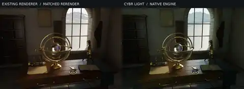

# Executed native comparison

This 480 × 176 WebP is a **downsampled documentation thumbnail** of two independently rendered 720 × 480 images, with labels above them. It is not a native-resolution quality check. The existing renderer is on the left; the actual CYBR LIGHT engine is on the right. The same non-neural filter, exposure, and white balance were applied to both images. No raw radiance was replaced, clipped, or upscaled.

The original 1800 × 1200 delivered image is preserved unchanged at [the baseline render](../../../scenes/observatory-iv/renders/Observatory_IV.png). That older image has different sampling and finishing settings, so it is not the matched comparison.

[Native execution measurements and hashes](execution.json) record the completed pair. Both engines recorded zero invalid samples. The LIGHT image is cooler/greener and still has sampling noise. Material translations and different sampling work prevent interpreting this as a ground-truth, convergence, or equal-time benchmark. The reconstruction can smooth genuine detail.

The delivered offline ZIP additionally contains the full matched PNGs, both unfiltered films, the native LIGHT EXR, guides, an offline comparison gallery, complete baseline source, pinned native-engine build inputs, and archive verification. This small Git preview does not substitute for those full-resolution files.

Reproduce the two render paths with the [documented runner](../README.md). The original scene subtree remains unchanged. [Engine additions](https://github.com/cybrdelic/cybr-light/pull/4) and [scene integration](https://github.com/cybrdelic/cybr-scenes/pull/3) remain separate proposed changes.
