# Full-geometry smoke gallery

These 64-pixel-wide CYBR LIGHT renders verify the actual complete scene geometry. They use a small sampling budget and are validation output. Filtered displays and unfiltered comparisons are retained; these are not production-quality previews. [Settings, geometry counts and hashes](renders.json).

| Scene | Filtered | Unfiltered |
| --- | --- | --- |
| basalt-tide | 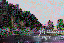 | 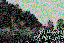 |
| desert-hot-springs | 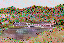 | 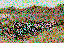 |
| drowned-geode | 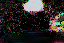 | 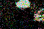 |
| fernwater | 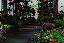 | 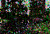 |
| observatory-iv | 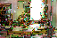 | 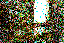 |
| obsidian-reach | 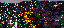 | 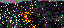 |
| sandstone-passage | 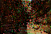 | 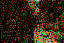 |
