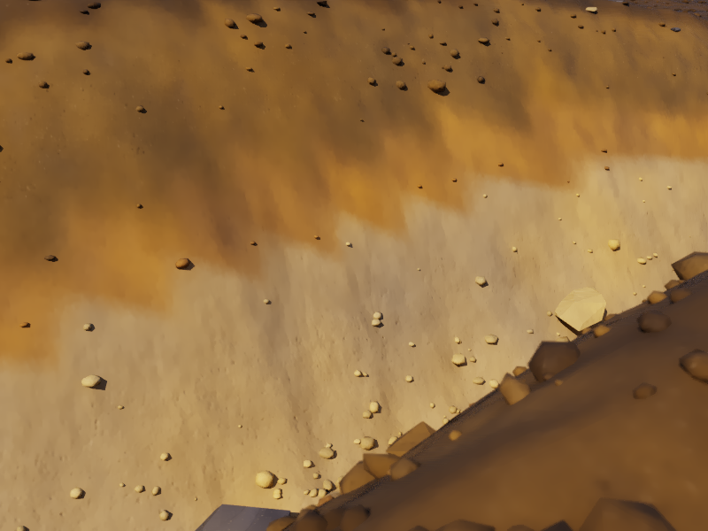

# CYBR TERRAIN transport previews

Actual CYBR LIGHT renders of CYBR GEO terrain meshes. Source, model scope and commands: [CYBR GEO terrain example](https://github.com/cybrdelic/cybr-geo/tree/codex/cybr-light-meshlets/examples/terrain).

| View | Resolution | Packets per pixel | Wavelengths per packet |
| --- | --- | ---: | ---: |
| Badlands | 800×600 | 96 | 8 |
| Watershed | 800×600 | 48 | 8 |
| Soil close-up, before and after | 800×600 | 64 | 8 |

| Badlands | Watershed | Soil horizons |
| --- | --- | --- |
|  |  |  |

| Independent triangle materials | Continuous soil contact material |
| --- | --- |
|  |  |

[Unfiltered watershed](watershed_unfiltered.png) · [Unfiltered soil](soil-profile_unfiltered.png) · [Earlier soil unfiltered](soil-profile-before_unfiltered.png).

The soil comparison preserves the same saved state, triangle geometry, camera and 64×8 sampling. The final soil render blends albedo, normals and roughness across contacts and uses a shared terrain surface guide ID. These remain procedural development renders; photographic realism is unfinished. Badlands and watershed precede the contact correction. The badlands linear film was not retained with its published PNG. Display filtering does not change the other retained native films.
